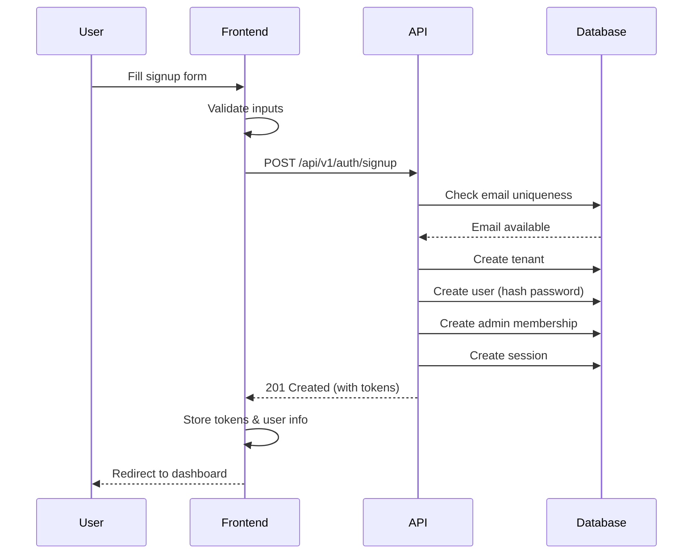

# User Signup API Specification

**Version:** 1.0
**Last Updated:** 2025-11-13
**Status:** ✅ Production Ready

---

## Overview

This document describes the self-service signup API that allows new users to create an organization (tenant) and administrator account. The signup flow automatically creates:

1. **New tenant (organization)** with a unique slug
2. **Admin user account** with hashed password
3. **Admin membership** linking user to tenant
4. **Session tokens** for immediate login (no email verification required)

**Key Features:**
- ✅ Auto-login after signup (session token returned)
- ✅ Rate limiting (4 signups per hour per IP address)
- ✅ Email uniqueness validation
- ✅ Unique slug generation from company name
- ✅ Admin role assigned automatically
- ✅ Comprehensive input validation

---

## Endpoint

### POST /api/v1/auth/signup

Creates a new organization and admin user account.

**Authentication:** Public (no token required)
**Rate Limit:** 4 requests per hour per IP address
**Content-Type:** application/json

---

## Request Schema

```typescript
interface SignupRequest {
  email: string;           // Valid email format, will be lowercased
  password: string;        // Minimum 8 characters
  firstName: string;       // 1-100 characters
  lastName: string;        // 1-100 characters
  companyName: string;     // 1-200 characters, used to generate slug
  timezone?: string;       // IANA timezone (e.g., "America/New_York"), defaults to "UTC"
  acceptedTerms: boolean;  // Must be true
}
```

### Validation Rules

| Field | Required | Min | Max | Rules |
|-------|----------|-----|-----|-------|
| `email` | ✅ | - | - | Valid email format, case-insensitive uniqueness check |
| `password` | ✅ | 8 | - | Stored as bcrypt hash (12 rounds) |
| `firstName` | ✅ | 1 | 100 | Required |
| `lastName` | ✅ | 1 | 100 | Required |
| `companyName` | ✅ | 1 | 200 | Used to generate unique slug |
| `timezone` | ❌ | - | - | IANA timezone string, defaults to "UTC" |
| `acceptedTerms` | ✅ | - | - | Must be `true` |

---

## Response Schema

### Success Response (201 Created)

```typescript
interface SignupResponse {
  data: {
    token: string;              // Session token (UUID)
    refreshToken: string;       // Refresh token (UUID)
    expiresAt: string;          // ISO 8601 datetime (30 days from now)
    user: {
      id: string;               // User UUID
      email: string;            // Lowercased email
      name: string;             // "firstName lastName"
    };
    tenant: {
      id: string;               // Tenant UUID
      name: string;             // Company name
      slug: string;             // Generated slug (e.g., "acme-corp")
    };
    membership: {
      role: "admin";            // Always "admin" for signup
      status: "active";         // Always "active" for signup
    };
  };
}
```

### Error Responses

#### 400 Bad Request - Validation Error
```json
{
  "error": "Bad Request",
  "message": "Validation failed: email is required",
  "statusCode": 400
}
```

**Common validation errors:**
- "Invalid email format"
- "Password must be at least 8 characters"
- "First name is required"
- "Last name is required"
- "Company name is required"
- "You must accept the terms and conditions"

#### 409 Conflict - Email Already Registered
```json
{
  "error": "Conflict",
  "message": "Email address is already registered",
  "statusCode": 409
}
```

**When this occurs:**
- Email already exists in the database (case-insensitive check)
- User should use the login endpoint instead or reset password

#### 429 Too Many Requests - Rate Limit Exceeded
```json
{
  "error": "Too Many Requests",
  "message": "Too many signup attempts. Maximum 4 signups per hour per IP address.",
  "statusCode": 429
}
```

**Rate limit details:**
- 4 signups per IP address per hour
- Counter resets after 1 hour
- Applies to ALL signup attempts from the same IP

---

## Frontend Implementation Guide

### 1. Signup Form Component

```typescript
interface SignupFormData {
  email: string;
  password: string;
  confirmPassword: string;  // For UI validation only
  firstName: string;
  lastName: string;
  companyName: string;
  timezone: string;
  acceptedTerms: boolean;
}

// Example validation
const validateForm = (data: SignupFormData): string[] => {
  const errors: string[] = [];

  if (!data.email || !/\S+@\S+\.\S+/.test(data.email)) {
    errors.push('Please enter a valid email address');
  }

  if (!data.password || data.password.length < 8) {
    errors.push('Password must be at least 8 characters');
  }

  if (data.password !== data.confirmPassword) {
    errors.push('Passwords do not match');
  }

  if (!data.firstName?.trim()) {
    errors.push('First name is required');
  }

  if (!data.lastName?.trim()) {
    errors.push('Last name is required');
  }

  if (!data.companyName?.trim()) {
    errors.push('Company name is required');
  }

  if (!data.acceptedTerms) {
    errors.push('You must accept the terms and conditions');
  }

  return errors;
};
```

### 2. API Client Function

```typescript
async function signup(data: SignupFormData): Promise<SignupResponse> {
  const response = await fetch('/api/v1/auth/signup', {
    method: 'POST',
    headers: {
      'Content-Type': 'application/json',
    },
    body: JSON.stringify({
      email: data.email.toLowerCase(),  // Normalize email
      password: data.password,
      firstName: data.firstName.trim(),
      lastName: data.lastName.trim(),
      companyName: data.companyName.trim(),
      timezone: data.timezone || Intl.DateTimeFormat().resolvedOptions().timeZone,
      acceptedTerms: data.acceptedTerms,
    }),
  });

  if (!response.ok) {
    const error = await response.json();
    throw new Error(error.message || 'Signup failed');
  }

  return response.json();
}
```

### 3. Store Session After Signup

```typescript
// After successful signup, store session data
const handleSignup = async (formData: SignupFormData) => {
  try {
    const response = await signup(formData);

    // Store tokens (use secure storage like httpOnly cookies or secure localStorage)
    localStorage.setItem('sessionToken', response.data.token);
    localStorage.setItem('refreshToken', response.data.refreshToken);
    localStorage.setItem('expiresAt', response.data.expiresAt);

    // Store user info for display
    localStorage.setItem('userId', response.data.user.id);
    localStorage.setItem('userEmail', response.data.user.email);
    localStorage.setItem('userName', response.data.user.name);

    // Store tenant info (for display purposes only - NOT sent in future requests)
    localStorage.setItem('tenantId', response.data.tenant.id);
    localStorage.setItem('tenantName', response.data.tenant.name);
    localStorage.setItem('tenantSlug', response.data.tenant.slug);

    // Store role
    localStorage.setItem('userRole', response.data.membership.role);

    // Redirect to dashboard
    window.location.href = '/dashboard';

  } catch (error) {
    console.error('Signup failed:', error);
    // Show error to user
  }
};
```

### 4. Error Handling

```typescript
const handleSignupError = (error: any) => {
  const statusCode = error.response?.status;

  switch (statusCode) {
    case 400:
      return 'Please check your input and try again.';
    case 409:
      return 'This email is already registered. Try logging in instead.';
    case 429:
      return 'Too many signup attempts. Please try again in an hour.';
    default:
      return 'Signup failed. Please try again later.';
  }
};
```

### 5. Rate Limit Handling

```typescript
// Track signup attempts in localStorage (client-side hint only)
const trackSignupAttempt = () => {
  const attempts = JSON.parse(localStorage.getItem('signupAttempts') || '[]');
  const now = Date.now();

  // Remove attempts older than 1 hour
  const recentAttempts = attempts.filter(
    (timestamp: number) => now - timestamp < 3600000
  );

  recentAttempts.push(now);
  localStorage.setItem('signupAttempts', JSON.stringify(recentAttempts));

  return recentAttempts.length;
};

const canAttemptSignup = (): boolean => {
  const attempts = JSON.parse(localStorage.getItem('signupAttempts') || '[]');
  const now = Date.now();

  const recentAttempts = attempts.filter(
    (timestamp: number) => now - timestamp < 3600000
  );

  return recentAttempts.length < 4;
};
```

---

## User Flow

### Happy Path



### Error Flows

#### Email Already Registered
```
User submits form → API checks email → Email exists → Return 409 Conflict → Show "Email already registered" error → Suggest login
```

#### Rate Limit Exceeded
```
User submits form → API checks rate limit → Limit exceeded → Return 429 → Show "Too many attempts" error → Suggest waiting 1 hour
```

#### Validation Error
```
User submits form → API validates input → Invalid data → Return 400 → Show specific validation errors → User corrects and resubmits
```

---

## Testing Examples

### cURL Example

```bash
# Success Case
curl -X POST http://localhost:3000/api/v1/auth/signup \
  -H "Content-Type: application/json" \
  -d '{
    "email": "john@newcompany.com",
    "password": "SecurePass123!",
    "firstName": "John",
    "lastName": "Doe",
    "companyName": "New Company Inc",
    "timezone": "America/New_York",
    "acceptedTerms": true
  }'

# Expected Response (201 Created)
{
  "data": {
    "token": "abc-123-...",
    "refreshToken": "xyz-789-...",
    "expiresAt": "2025-12-13T00:00:00.000Z",
    "user": {
      "id": "uuid-here",
      "email": "john@newcompany.com",
      "name": "John Doe"
    },
    "tenant": {
      "id": "uuid-here",
      "name": "New Company Inc",
      "slug": "new-company-inc"
    },
    "membership": {
      "role": "admin",
      "status": "active"
    }
  }
}
```

```bash
# Error Case: Email Already Exists
curl -X POST http://localhost:3000/api/v1/auth/signup \
  -H "Content-Type: application/json" \
  -d '{
    "email": "existing@example.com",
    "password": "password123",
    "firstName": "Jane",
    "lastName": "Smith",
    "companyName": "Another Company",
    "acceptedTerms": true
  }'

# Expected Response (409 Conflict)
{
  "error": "Conflict",
  "message": "Email address is already registered",
  "statusCode": 409
}
```

### JavaScript/TypeScript Example

```typescript
// React Hook Example
import { useState } from 'react';

export function useSignup() {
  const [loading, setLoading] = useState(false);
  const [error, setError] = useState<string | null>(null);

  const signup = async (data: SignupFormData) => {
    setLoading(true);
    setError(null);

    try {
      const response = await fetch('/api/v1/auth/signup', {
        method: 'POST',
        headers: { 'Content-Type': 'application/json' },
        body: JSON.stringify({
          email: data.email.toLowerCase(),
          password: data.password,
          firstName: data.firstName.trim(),
          lastName: data.lastName.trim(),
          companyName: data.companyName.trim(),
          timezone: data.timezone || Intl.DateTimeFormat().resolvedOptions().timeZone,
          acceptedTerms: data.acceptedTerms,
        }),
      });

      if (!response.ok) {
        const errorData = await response.json();
        throw new Error(errorData.message);
      }

      const result = await response.json();

      // Store session
      localStorage.setItem('sessionToken', result.data.token);
      localStorage.setItem('refreshToken', result.data.refreshToken);
      localStorage.setItem('userId', result.data.user.id);
      localStorage.setItem('tenantId', result.data.tenant.id);
      localStorage.setItem('userRole', result.data.membership.role);

      return result.data;

    } catch (err: any) {
      setError(err.message || 'Signup failed');
      throw err;
    } finally {
      setLoading(false);
    }
  };

  return { signup, loading, error };
}
```

---

## Important Notes

### ⚠️ Security Considerations

1. **Never send tenant ID in future requests**
   - Tenant context is extracted from session token automatically
   - Sending tenant_id in requests is unnecessary and ignored

2. **Store tokens securely**
   - Use httpOnly cookies for production
   - If using localStorage, implement XSS protection

3. **Password requirements**
   - Minimum 8 characters (enforced by API)
   - Consider adding frontend strength meter
   - API hashes with bcrypt (12 rounds)

4. **Email normalization**
   - Always lowercase emails before sending
   - API does case-insensitive uniqueness check

### 🎯 UX Best Practices

1. **Show password requirements upfront**
   - "At least 8 characters"
   - Consider showing password strength indicator

2. **Pre-fill timezone**
   - Use `Intl.DateTimeFormat().resolvedOptions().timeZone`
   - Allow user to change if needed

3. **Handle rate limiting gracefully**
   - Show countdown timer after 4th attempt
   - Consider implementing exponential backoff

4. **Provide clear error messages**
   - Map API errors to user-friendly messages
   - Highlight specific fields with errors

5. **Auto-login after signup**
   - Store session tokens immediately
   - Redirect to onboarding or dashboard
   - Show welcome message with next steps

### 📝 Slug Generation Logic

- Company name → lowercase → replace spaces with hyphens → remove special chars
- Examples:
  - "Acme Corporation" → "acme-corporation"
  - "My Company!" → "my-company"
  - "Test 123" → "test-123"
- Collision handling: Appends counter if slug exists
  - "acme-corp" (taken) → "acme-corp-1"
  - "acme-corp-1" (taken) → "acme-corp-2"

---

## Integration Checklist

- [ ] Create signup form with all required fields
- [ ] Implement client-side validation
- [ ] Add password strength indicator
- [ ] Pre-fill timezone from browser
- [ ] Handle 400/409/429 error responses
- [ ] Store session tokens securely
- [ ] Implement rate limit tracking (client-side hint)
- [ ] Add loading states during API call
- [ ] Redirect to dashboard after successful signup
- [ ] Test with various email formats
- [ ] Test with special characters in company name
- [ ] Test rate limiting (4 attempts)
- [ ] Test duplicate email handling
- [ ] Verify auto-login functionality

---

## Support

For questions or issues, contact the backend team or refer to:
- API Documentation: `/api-docs` (Swagger UI)
- Main project README: `/README.md`
- Testing guide: `/TESTING.md`
